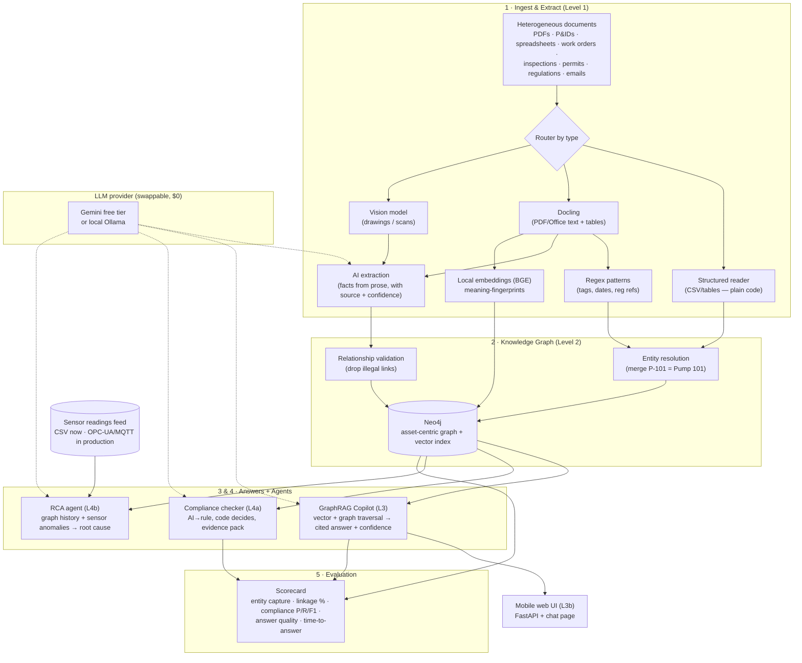

# Architecture — Unified Asset & Operations Brain

Everything runs locally and free. The "brain" (LLM) is the only swappable external
piece; everything else is open-source and on-device.

## The data stores (two layers)
- **Neo4j** — the connections store: the asset-centric graph **and** the vector index for meaning-search (one tool at hackathon scale; Qdrant is the scale-out path).
- **Postgres / MinIO** — app state and raw-file storage (local).

## Why each choice
- **Knowledge graph (Neo4j):** industrial documents are relationship-heavy; the graph is what lets the system reason *across* departments (the whole point of the problem).
- **Hybrid extraction:** plain code/rules for structured + predictable data; AI only for messy prose — more accurate, cheaper, every fact traceable to a source.
- **Hybrid compliance:** the AI turns regulations into checkable rules, but **plain code makes the pass/fail decision** — so compliance verdicts are reliable, not hallucinated.
- **Computed confidence:** built from retrieval score + source support + graph-fact confidence, not the model's self-report.
- **Local + swappable LLM:** runs free, and the offline option suits plants that can't send data to the cloud.
